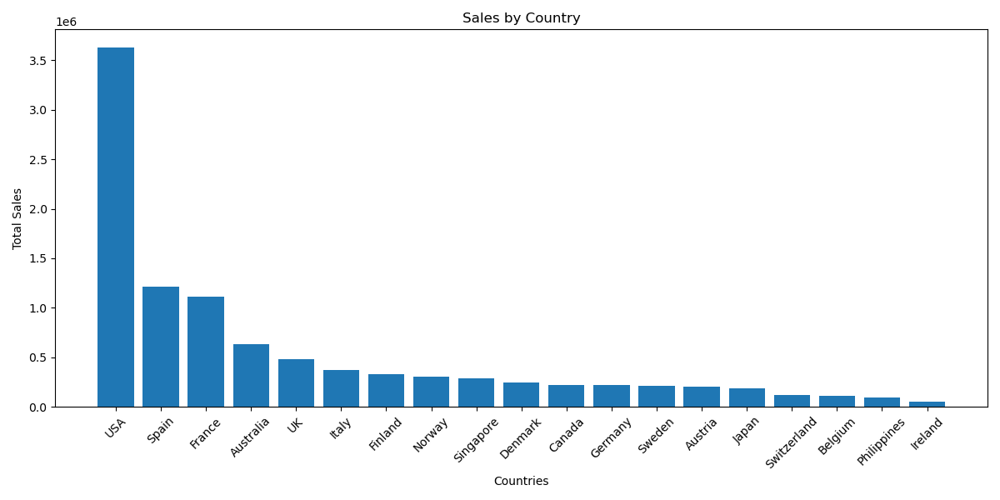

# 📊 Sales Analysis Portfolio Project

## 📌 Project Overview
This project analyzes sales data from an international retail company using Python and data analysis techniques to identify trends, top-performing products, countries, customers, and business opportunities.

---

## 🛠️ Tools Used
- Python
- Pandas
- NumPy
- Matplotlib
- Jupyter Notebook

---

## 📈 Key Findings
- Total Sales: $10,032,628.85
- Best Product Line: Classic Cars
- Best Country: USA
- Best Month: November
- Top Customer: Euro Shopping Channel

---

## 💡 Business Insights
- Classic Cars generated the highest revenue.
- The USA is the company's strongest market.
- Sales peak significantly in November.
- A small number of customers contribute heavily to revenue.
- Diversifying the customer base can reduce business risk.

---

## 🚀 Skills Demonstrated
- Data Cleaning
- Exploratory Data Analysis (EDA)
- Data Visualization
- Business Analysis
- Statistical Analysis
## 📊 Visualizations

### Sales by Country

### Sales by Product Line

### Top Customers

